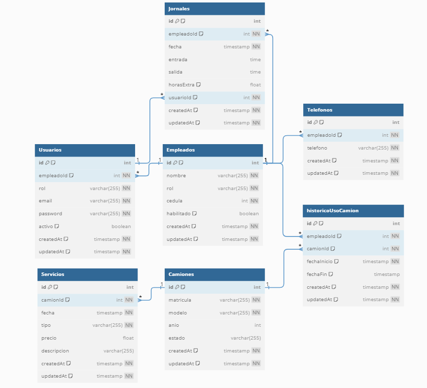

# Documentación de los Modelos

### Referencia Visual

### Empleados

- **id** `int` | `PRIMARY KEY`, `SERIAL`: Identificador único del empleado
- **nombre** `varchar(255)` | `NOT NULL`: Nombre del empleado
- **rol** `varchar(255)` | `NOT NULL`: Rol del empleado
- **cedula** `int` | `NOT NULL`: Número de cédula del empleado
- **habilitado** `boolean` | `DEFAULT true`: Estado de habilitación del empleado
- **createdAt** `timestamp` | `NOT NULL`: Fecha de creación del registro
- **updatedAt** `timestamp` | `NOT NULL`: Fecha de última actualización del registro

### Telefonos

- **id** `int` | `PRIMARY KEY`, `SERIAL`: Identificador único del teléfono
- **empleadoId** `int` | `FOREIGN KEY`, `REFERENCES Empleados(id)`, `NOT NULL`: ID del empleado asociado al teléfono
- **telefono** `varchar(255)` | `NOT NULL`, `UNIQUE`: Número de teléfono
- **createdAt** `timestamp` | `NOT NULL`: Fecha de creación del registro
- **updatedAt** `timestamp` | `NOT NULL`: Fecha de última actualización del registro

### Usuarios

- **id** `int` | `PRIMARY KEY`, `SERIAL`: Identificador único del usuario
- **empleadoId** `int` | `FOREIGN KEY`, `REFERENCES Empleados(id)`, `NOT NULL`: ID del empleado asociado al usuario
- **rol** `varchar(255)` | `NOT NULL`: Rol del usuario
- **email** `varchar(255)` | `NOT NULL`, `UNIQUE`: Dirección de correo electrónico del usuario
- **password** `varchar(255)` | `NOT NULL`: Contraseña del usuario
- **activo** `boolean` | `DEFAULT false`: Estado de activación del usuario
- **createdAt** `timestamp` | `NOT NULL`: Fecha de creación del registro
- **updatedAt** `timestamp` | `NOT NULL`: Fecha de última actualización del registro

### Camiones

- **id** `int` | `PRIMARY KEY`, `SERIAL`: Identificador único del camión
- **matricula** `varchar(255)` | `NOT NULL`, `UNIQUE`: Matrícula del camión
- **modelo** `varchar(255)` | `NOT NULL`: Modelo del camión
- **anio** `int`: Año de fabricación del camión
- **estado** `varchar(255)`: Estado del camión
- **createdAt** `timestamp` | `NOT NULL`: Fecha de creación del registro
- **updatedAt** `timestamp` | `NOT NULL`: Fecha de última actualización del registro

### Servicios

- **id** `int` | `PRIMARY KEY`, `SERIAL`: Identificador único del servicio
- **camionId** `int` | `FOREIGN KEY`, `REFERENCES Camiones(id)`, `NOT NULL`: ID del camión asociado al servicio
- **fecha** `timestamp` | `NOT NULL`: Fecha del servicio
- **tipo** `varchar(255)` | `NOT NULL`: Tipo de servicio
- **precio** `float`: Precio del servicio
- **descripcion** `varchar(255)`: Descripción del servicio
- **createdAt** `timestamp` | `NOT NULL`: Fecha de creación del registro
- **updatedAt** `timestamp` | `NOT NULL`: Fecha de última actualización del registro

### HistoricoUsoCamion

- **id** `int` | `PRIMARY KEY`, `SERIAL`: Identificador único del registro histórico
- **empleadoId** `int` | `FOREIGN KEY`, `REFERENCES Empleados(id)`, `NOT NULL`: ID del empleado asociado al registro histórico
- **camionId** `int` | `FOREIGN KEY`, `REFERENCES Camiones(id)`, `NOT NULL`: ID del camión asociado al registro histórico
- **fechaInicio** `timestamp` | `NOT NULL`: Fecha de inicio del uso del camión
- **fechaFin** `timestamp`: Fecha de fin del uso del camión
- **createdAt** `timestamp` | `NOT NULL`: Fecha de creación del registro
- **updatedAt** `timestamp` | `NOT NULL`: Fecha de última actualización del registro

### Jornales

- **id** `int` | `PRIMARY KEY`, `SERIAL`: Identificador único del jornal
- **empleadoId** `int` | `FOREIGN KEY`, `REFERENCES Empleados(id)`, `NOT NULL`: ID del empleado asociado al jornal
- **fecha** `timestamp` | `NOT NULL`: Fecha del jornal
- **entrada** `time`: Hora de entrada del jornal
- **salida** `time`: Hora de salida del jornal
- **horasExtra** `float` | `DEFAULT '0'`: Horas extra trabajadas
- **usuarioId** `int` | `FOREIGN KEY`, `REFERENCES Usuarios(id)`: ID del usuario que registró el jornal
- **createdAt** `timestamp` | `NOT NULL`: Fecha de creación del registro
- **updatedAt** `timestamp` | `NOT NULL`: Fecha de última actualización del registro
